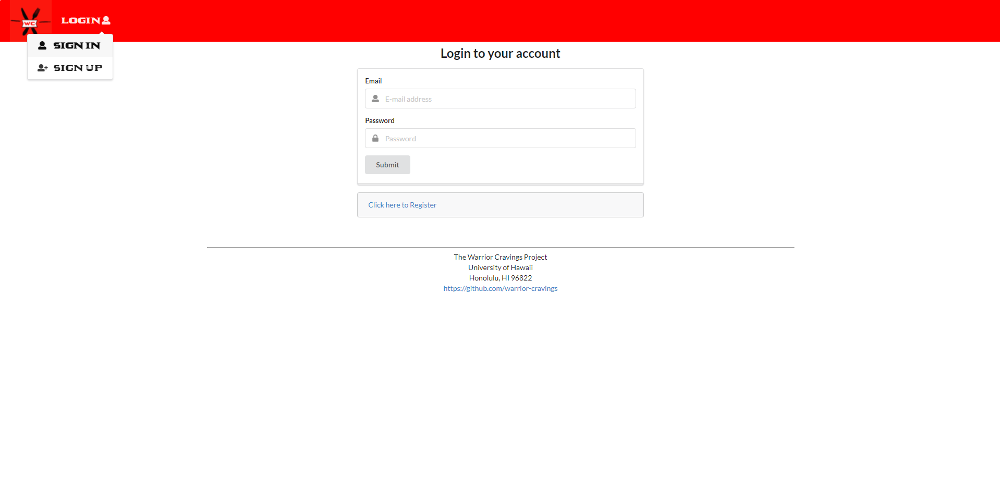
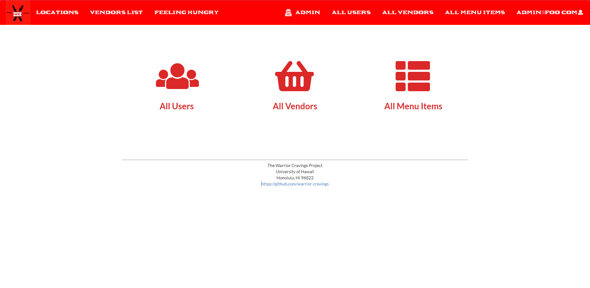
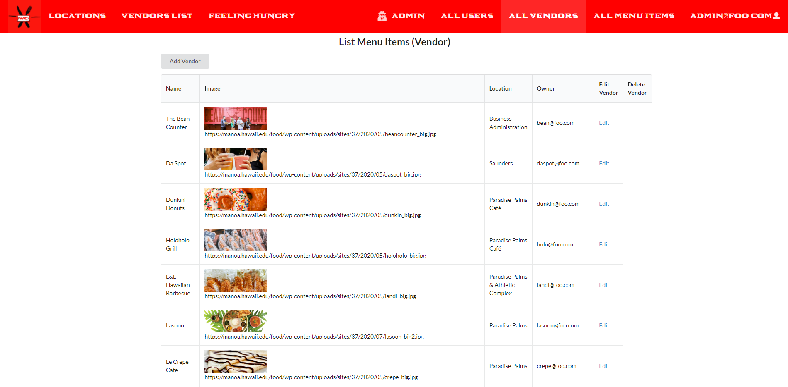
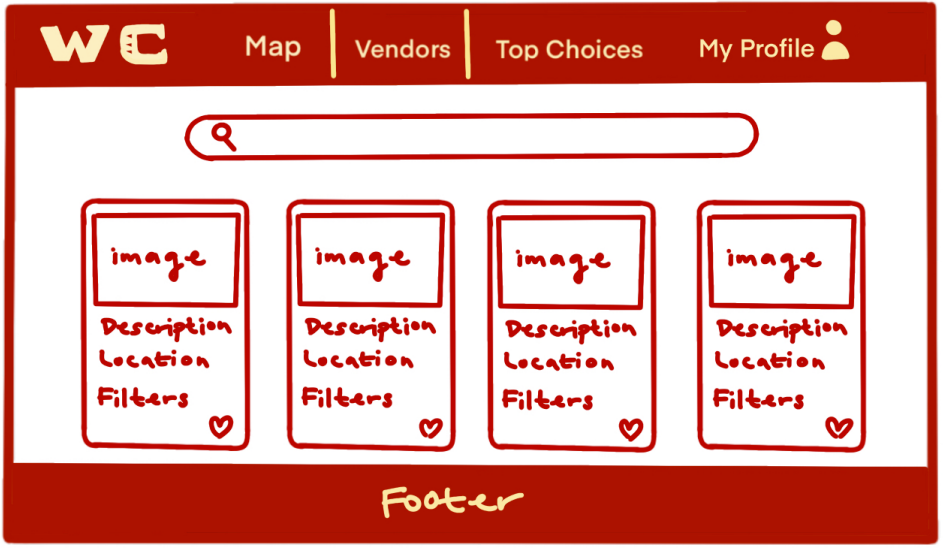
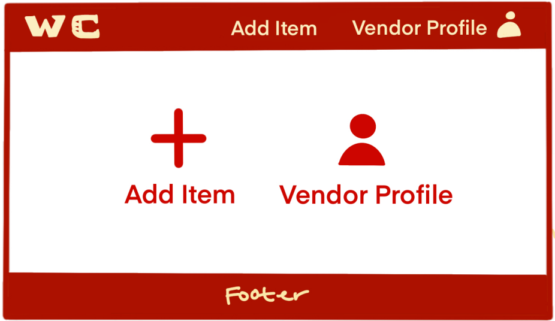
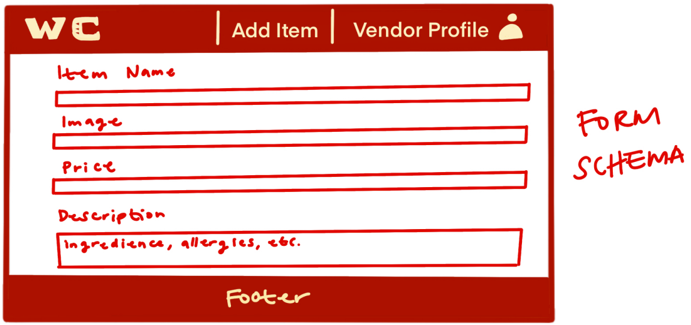

# Table of contents

* [Overview](#overview)
* [Deployment](#deployment)
* [Documentation](#warrior-cravings-documentation)
* [Developers Guide](#developers-guide)
* [Milestones](#warrior-cravings-milestones)
* [Community Feedback](#community-feedback)
* [Team and Contract](#team-and-contract)

# Overview

Warrior Cravings is a web application that provides a chance to view the many different food choices on campus (Campus Center, Food Trucks, Paradise Palms, etc.). The following elements may be included in the web application:

* [Meteor](https://www.meteor.com/) for Javascript-based implementation of client and server code.
* [React](https://reactjs.org/) for component-based UI implementation and routing.
* [Semantic UI React](https://react.semantic-ui.com/) CSS Framework for UI design.
* [Uniforms](https://uniforms.tools/) for React and Semantic UI-based form design and display.

# Deployment
The following link will connect you to our deployed application on Digital Ocean:
[Warrior Cravings Application](https://warrior-cravings.xyz/)

# Warrior Cravings Documentation

The following section is guide of the many capabilities and features of Warrior Cravings!

## Landing Page

Before logging in, every user will start at the landing page and see a summary of Warrior Cravings.

[//]: # (![]&#40;images/landing-page.png&#41;)


## Sign in and Register

Sign into your account or get a chance to register as either a User or Vendor to be a part of Warrior Cravings.

[//]: # (![]&#40;images/signin-page.png&#41;)

[//]: # (![]&#40;images/signup-page.png&#41;)



## Admin Profile

In the Admin Profile, you have many different administrative features to help improve and maintain the application.



#### Add / Approve Vendor

As an Admin, you can add/approve new Vendors to update the database as new food options become available.

#### Archive / Delete Vendor

Pending any circumstance where the Vendor and food option becomes unavailable, an Admin can archive or delete the Vendor from the database.

#### View Vendors

View the list of all Vendors, with an option to include/exlude archived Vendors.



## User Profile

In the User Profile, you are in a one-stop shop with different features to view the food options available.


#### View Food Map

Interact with a map of Campus containing all the different food options locations.


#### View Vendors List

View a list of all available Vendors and their menu items.



### Feeling Hungry

Click on this option to randomly generate places to eat when you feel hungry but do not know where to go.

## Vendor Profile

In the Vendor Profile (upon approval of the Admin), you get a chance to expose and share your food to all the users.

#### Add Vendor Page

Add your menu items and locations to be added to the database so users can find and eat your food!





#### Edit Vendors Page

In the case of adding/removing menu items, you can easily edit your page to update your menu items for users to see.

# Developers Guide

This guide is more aspiring Meteor developers who seek to create something similar to this website or wish to go further beyond this current build.

## First Step - Install Meteor

The first step to use Meteor is to install it which can be found here [How To Install Meteor](https://docs.meteor.com/install.html).

## Second Step - Create A Local Copy of the Template

The next step is to create a local copy of this template to your computer. First go to our applications page, [Warrior Cravings Github Page](https://github.com/warrior-cravings/warrior-cravings), then click on the green "Code". Once inside the dropdown menu click on "Use This Template" to create a copy to your Github. Then in your Github's Warrior-Cravings, click on "Code" again to open it up with Github desktop to create a local copy. 

## Third Step - Start The Web Page

Once inside the repo, go into the app directory by using the command ```cd app ``` and install libraries with ``` $ meteor npm install ``` then finally run ```$ meteor npm run start ```. You should then see your application at http://localhost:3000.

# Warrior Cravings Milestones

Track our progress as we develop Warrior Cravings!

## Milestone 1

See Milestone 1 here [Warrior Cravings GitHub Project Board M1](https://github.com/warrior-cravings/warrior-cravings/projects/1)

[//]: # (![]&#40;images/project-board-1.png&#41;)

## Milestone 2

See Milestone 2 here [Warrior Cravings GitHub Project Board M2](https://github.com/warrior-cravings/warrior-cravings/projects/2)

## Milestone 3

See Milestone 3 here [Warrior Cravings GitHub Project Board M3](https://github.com/warrior-cravings/warrior-cravings/projects/3)

# Community Feedback

## Positive Feedback

## Constructive Criticism

# Team and Contract

Warrior Cravings is designed and developed by:

[Christine Nakano](https://github.com/Cknakano).

[Jase Ishimi](https://github.com/ishimi8).

[Louie Bala](https://github.com/Louie808).

[Mahie Crabbe](https://github.com/mahi3crab).

[Zachary Chaikin](https://github.com/zchaikin).

The link to the Team Bonding & Team Contract Document can be found [here](https://docs.google.com/document/d/1SRTYNonslrtiFPJDW3MKqytMh0vnHxiC6MnLjCrtIrs/edit#)
