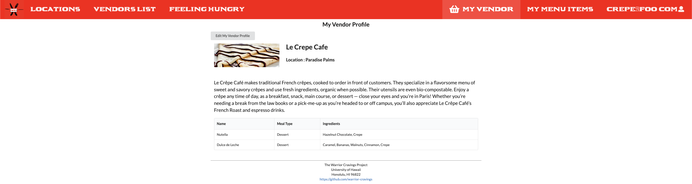

# Warrior Cravings

# Table of contents

* [Overview](#overview)
* [Deployment](#deployment)
* [Documentation](#warrior-cravings-documentation)
* [Developers Guide](#developers-guide)
* [Milestones](#warrior-cravings-milestones)
* [Community Feedback](#community-feedback)
* [Team and Contract](#team-and-contract)

# Overview

Warrior Cravings is a web application that provides a chance to view the many different food choices on campus (Campus Center, Food Trucks, Paradise Palms, etc.). The following elements may be included in the web application:

* [Meteor](https://www.meteor.com/) for Javascript-based implementation of client and server code.
* [React](https://reactjs.org/) for component-based UI implementation and routing.
* [Semantic UI React](https://react.semantic-ui.com/) CSS Framework for UI design.
* [Uniforms](https://uniforms.tools/) for React and Semantic UI-based form design and display.

# Deployment
The following link will connect you to our deployed application on Digital Ocean:
[Warrior Cravings Application](https://warrior-cravings.xyz/)

# Warrior Cravings Documentation

The following section is a guide to the many capabilities and features of Warrior Cravings!

## Landing Page

Before logging in, every user will start at the landing page and see a summary of Warrior Cravings.

[//]: # (![](images/landing-page.png))


## Sign in and Register

Sign in to your account or get a chance to register as either a User or Vendor to be a part of Warrior Cravings.

[//]: # (![](images/signin-page.png))

[//]: # (![](images/signup-page.png))


## Admin Profile

In the Admin Profile, you have many different administrative features to help improve and maintain the application.


#### Add / Approve Vendor

As an Admin, you can add/approve new Vendors to update the database as new food options become available.

#### Archive / Delete Vendor

Pending any circumstance where the Vendor and food option becomes unavailable, an Admin can archive or delete the Vendor from the database.

#### View Vendors

View the list of all Vendors, with an option to include/exclude archived Vendors.


## User Profile

In the User Profile, you are in a one-stop shop with different features to view the food options available.


#### View Food Map

Interact with a map of the campus containing all the different food options locations.


#### View Vendors List

View a list of all available Vendors and their menu items.


### Feeling Hungry

Click on this option to randomly generate places to eat when you feel hungry but do not know where to go.


## Vendor Profile

In the Vendor Profile (upon approval of the Admin), you get a chance to expose and share your food with all the users.


#### Add Vendor Page

Add your Vendor profile to the database so users can find and eat your food!



#### Edit Vendors Page

Edit your vendor page to update the database so users are always in sync with updates.

#### View Menu Items

View your menu items being displayed to the users.


#### Add/Edit/Delete Menu Items

Add, edit, and delete menu items to your vendor page so users can be up to date and see all the different food choices to eat!

# Developers Guide

This guide is more for aspiring Meteor developers who seek to create something similar to this website or wish to go further beyond this current build.

## First Step - Install Meteor

The first step to using Meteor is to install it which can be found here [How To Install Meteor](https://docs.meteor.com/install.html).

## Second Step - Create A Local Copy of the Template

The next step is to create a local copy of this template on your computer. First go to our applications page, [Warrior Cravings Github Page](https://github.com/warrior-cravings/warrior-cravings), then click on the green "Code". Once inside the dropdown menu click on "Use This Template" to create a copy to your Github. Then in your Github's Warrior-Cravings, click on "Code" again to open it up with the Github desktop to create a local copy.

## Third Step - Start The Web Page

Once inside the repo, go into the app directory by using the command ```cd app ``` and install libraries with ``` $ meteor npm install ``` then finally run ```$ meteor npm run start ```. You should then see your application at http://localhost:3000.

# Warrior Cravings Milestones

Track our progress as we develop Warrior Cravings!

## Milestone 1

See Milestone 1 here [Warrior Cravings GitHub Project Board M1](https://github.com/warrior-cravings/warrior-cravings/projects/1)

[//]: # (![](images/project-board-1.png))

## Milestone 2

See Milestone 2 here [Warrior Cravings GitHub Project Board M2](https://github.com/warrior-cravings/warrior-cravings/projects/2)

## Milestone 3

See Milestone 3 here [Warrior Cravings GitHub Project Board M3](https://github.com/warrior-cravings/warrior-cravings/projects/3)

# Community Feedback

## Positive Feedback

- I like how everything is organized and neat. It's easy to find things on the site. I like how everything is easy to read since the descriptions are short and sweet. I also appreciate how you added where each restaurant could be found and the maps to it—super helpful.
- Very organized! A nice and simple design/layout makes the website easy to navigate.
- I like how the website is simple and informative especially the locations because I had no clue about where they are because I only ever go to the architecture building.
- I like the feeling hungry option because I'm indecisive and can't decide what I want to eat.
- I like how the vendors can add different menu items and update their own profiles.

## Constructive Criticism

- I don't know if it's because I'm on an iPad but when I click on some of the vendors, my screen would go white and I would have to refresh my browser.
- Many people will most likely use it on their phone, so maybe make it fit different webpage sizes.
- Some features should be shown without requiring someone to sign up so people can see if they want to use the site or not.
- Images on the vendor's list page should be relatively the same size to make it look more uniform.
- Maybe a few more pics for each vendor.

# Team and Contract

Warrior Cravings is designed and developed by:

[Christine Nakano](https://github.com/Cknakano).

[Jase Ishimi](https://github.com/ishimi8).

[Louie Bala](https://github.com/Louie808).

[Mahie Crabbe](https://github.com/mahi3crab).

[Zachary Chaikin](https://github.com/zchaikin).

The link to our organization can be found [here](https://github.com/warrior-cravings) and the Team Bonding & Team Contract Document can be found [here](https://docs.google.com/document/d/1SRTYNonslrtiFPJDW3MKqytMh0vnHxiC6MnLjCrtIrs/edit#)

# Build Status

